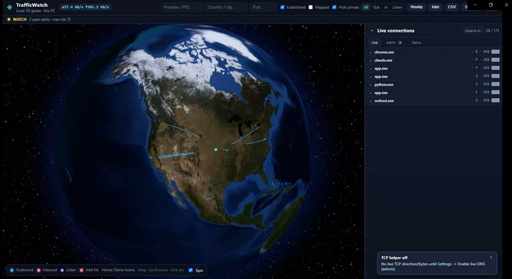

# TrafficWatch

Local-only live **3D globe** of where your local PC/Laptop's TCP/UDP traffic is routing (inbound/outbound). Dark UI with globe.gl arcs and a live connection list — not Wireshark/Nmap.

**Bind:** `127.0.0.1` only | **Default port:** `8767` | **Shell:** pywebview desktop  
No telemetry. No accounts. No packet capture / payload decode / port scanning.

## Demo



Optional motion capture (may not autoplay on GitHub): [demo.webm](docs/readme/demo.webm) · [demo.gif](docs/readme/demo.gif)

## Why I built this

Local-first, metadata first — paranoid on purpose, pragmatic about it. I wanted a glanceable map of *where* your local PC/Laptop is talking without spinning up a full packet lab or shipping my traffic somewhere else. Connection endpoints, process names, rough geo — enough signal to notice weird outbound paths, not a packet dump. Runs on the box, stays on the box.

- Binds `127.0.0.1` only (no LAN expose)
- No telemetry, no accounts, no cloud sync
- No packet capture, payload decode, or port scanning — connection metadata and process context only
- Command lines are redacted by default (tokens / long secrets masked); reveal is authenticated and not persisted
- Wi‑Fi network name is not written into alert history; it is only shown on your own screen.
- Secrets and local DB caches live under `data/` (gitignored) — not shipped in the repo
- UI assets vendored under `app/static/vendor/` (no runtime CDN)

## Requirements

**Both OS:** Python 3.10+ | network once for `pip install` and the free **DB-IP City Lite** MMDB into `data/` (personal / non-commercial; [DB-IP Free](https://db-ip.com/db/lite.php)). UI JS/textures are vendored under `app/static/vendor/` (no runtime CDN).

### Windows 10/11

- Python on PATH (`py` or `python`)
- Edge WebView2 (bundled with current Windows / Edge) for the desktop window
- Launcher: `start.ps1` / `Launch-TrafficWatch.bat`

### Linux

- `python3` 3.10+ and `python3-venv`
- Launcher: `./start.sh` (creates `.venv`, `pip install -r app/requirements.txt`)
- **Desktop window** (optional) needs a WebView backend. pip `pywebview` alone is not enough:
  - Debian/Ubuntu: `sudo apt install python3-gi python3-gi-cairo gir1.2-gtk-3.0 gir1.2-webkit2-4.1`
  - Fedora: `sudo dnf install python3-gobject gtk3 webkit2gtk4.1`
  - Or Qt: `pip install qtpy PyQt5` plus system Qt
- Without those packages, `./start.sh` starts the server and opens the system browser.
- **Server only:** `./start.sh --server`

## Quick start

### Windows

```powershell
cd path\to\TrafficWatch
.\start.ps1
```

Browser fallback: `.\start.ps1 -Browser` | Server only: `.\start.ps1 -NoBrowser`

Quit by closing the window or clicking **Quit** in the top bar (frees port 8767).

### Linux

```bash
cd /path/to/TrafficWatch
chmod +x start.sh   # once
./start.sh
```

Server only: `./start.sh --server` | Force browser: `./start.sh --browser`
